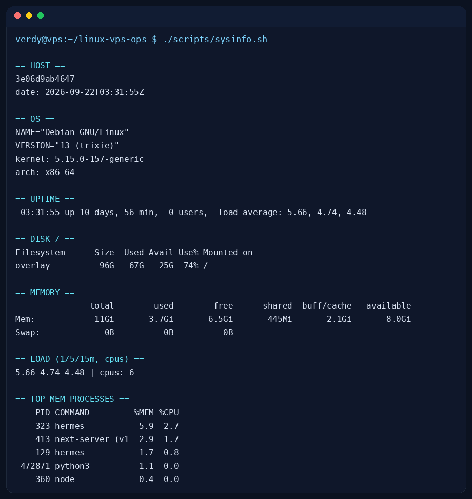

# docker-coolify-nginx

Containerized deploys the boring-reliable way: Docker Compose app behind an
Nginx reverse proxy with TLS + security headers, deployed to a Coolify-managed
VPS, with a rollback path. Mirrors how I ship small production workloads.

## What this proves
Docker (multi-service Compose) · Nginx reverse proxy + TLS · Cloudflare
SSL/CDN in front · Coolify self-hosted deploys · rollback discipline.

## Quickstart (fork-friendly)

```bash
git clone https://github.com/verdynordsten/docker-coolify-nginx.git
cd docker-coolify-nginx

cp .env.example .env            # fill DOMAIN + ACME_EMAIL
docker compose config           # validate without starting anything
docker compose up -d --build    # start
curl -sk https://yourdomain/   # via Cloudflare / local TLS

bash tests/test.sh              # self-test, no daemon required
```

To deploy on your Coolify VPS instead, follow `docs/coolify-guide.md`
(connect repo → set env → deploy → rollback tag).

## Layout

| Path | What |
|---|---|
| `docker-compose.yml` | app + nginx + postgres, one network, named volumes |
| `nginx/nginx.conf` | reverse proxy, TLS, security headers, /healthz |
| `app/` | tiny demo service (python stdlib, `/` + `/healthz`) |
| `.env.example` | every knob, no secrets inside |
| `scripts/deploy.sh` | pull → build → migrate → health-gate |
| `scripts/rollback.sh` | retag to previous image and restart |
| `docs/coolify-guide.md` | Coolify + Cloudflare wiring, step by step |
| `tests/test.sh` | compose/yaml + nginx + script checks |

## Evidence (real run)




